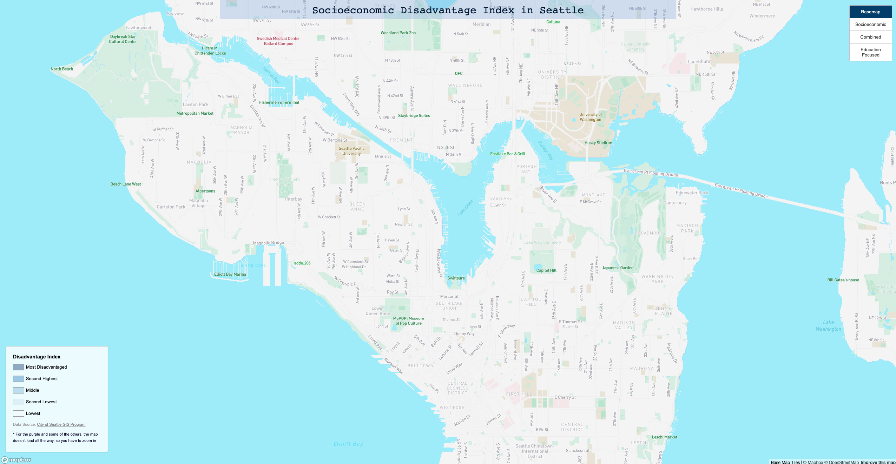
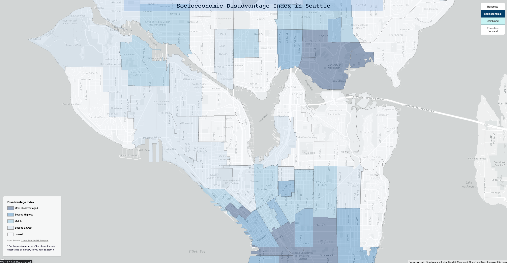
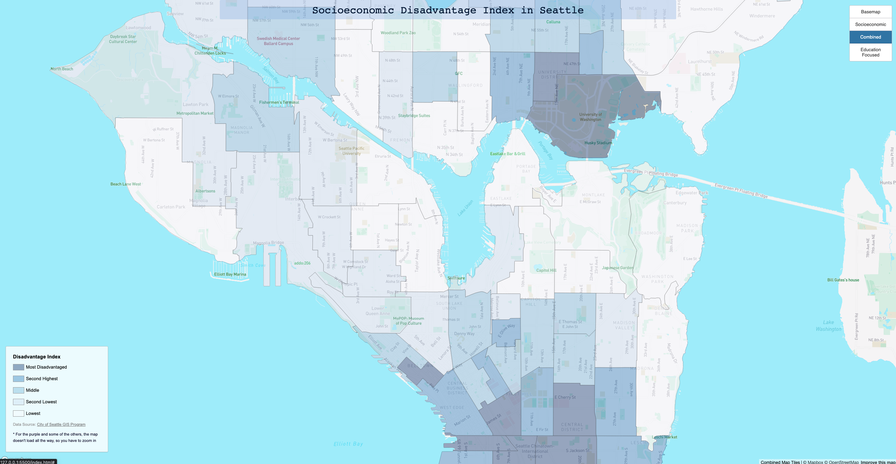
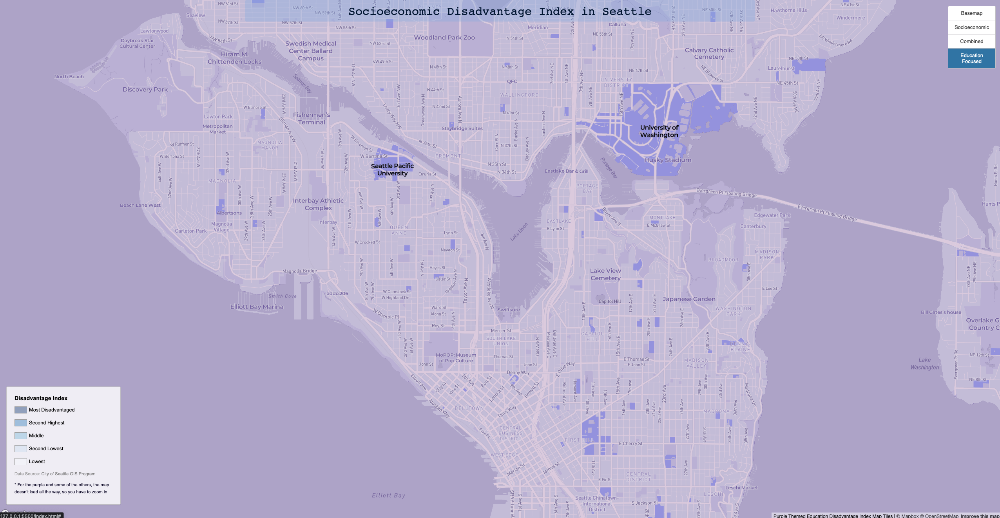

# Socioeconomic Disadvantage Index in Seattle

In this lab, the tilesets include the basemap, socioeconomic disadvantage index map, a combined map, and education focused theme map. The geographic area that I am examining is Seattle. I chose this area since I wanted to explore what type of data other than the usual choices I could compare on the map. After looking at what I could focus on and customize in Mapbox I centered down on looking at the socioeconmic disadvantage index of each neighborhood in Seattle.

The Socioeconomic Disadvantage Index ranks census tracts
by an index of two equally weighted measures:

- Income below 200% of poverty level
- Educational attainment less than a bachelor’s degree

So I chose to focus most of my maps around education institutions to see if the access to education in these areas correspond to the severity of the disadvantage for people in these areas.

Lastly, each tileset is available to zomm in and out via the scroll wheel, but initially they are set to a zoom level of 13. I chose this mainly becuase while making the maps the map itself wouldn't render unless I zoomed in, so by setting the inital zoom to 13, one can see each layer properly and drag around the map to view other areas.

The first tileset makes the basemap. In the basemap I chose to go with a lighter map color scheme, so that I could contrast the areas I wanted to focus on with darker colors since on mapbox, colors seem to have some sort of lightening effect which makes them a bit opaque. But in the basemap I chose to highlight education institutes in tan and then parks in green. i chose to highlight these two areas since 1) for the purpose of topic I wanted to show where all the schools were and then 2) I wanted to label where all and any parks are located becasue usually I see areas around nice parks to be more affluent or richer and I wanted to see if that was a factor at all.

The second tileset makes up the socioeconomic disadvantage index map. This map also pairs with the legend on the bottom left, shows the disadvantage index via census tracts of neighborhoods in Seattle. So areas that have a darker shade of blue have a greater disadvantage in education attainment and income and areas with a lighter shade of blue have less of an disadvantage.

The third tile set makes up the combined basemap and socioeconomic disadvantage map. Compared to the previous map, with the basemap, once can identify the parks and education institutes a much easier. The combined map is focused on trying to identify areas with schools and parks and checking to see if the index in those areas are high or low. And for the most part, the areas with bigger parks seem to have less of a disadvantage, but surprisingly the areas universities and schools have a big disadvantage still. But the overall color scheme of both maps focused on blue and cooler colors.

The last tile set makes up a themed map. The theme of the map is tied to the education. Now I chose purple mainly because of UW's main color is purple and it is a major education institution for Washington. But the theme here, clearly identifies all education institutes in Seattle wih the names being heavily bolded and their campuses highlighted with a darker shade of blueish-purple. The purpose was to clearly be able to see the education institutes with ease, with that I made the roads and base of the map, very closely colored so that the only color was coming from the schools.

[Click here to view Webmap](https://ajazksyed.github.io/Map_Tilesets_Generation/)
